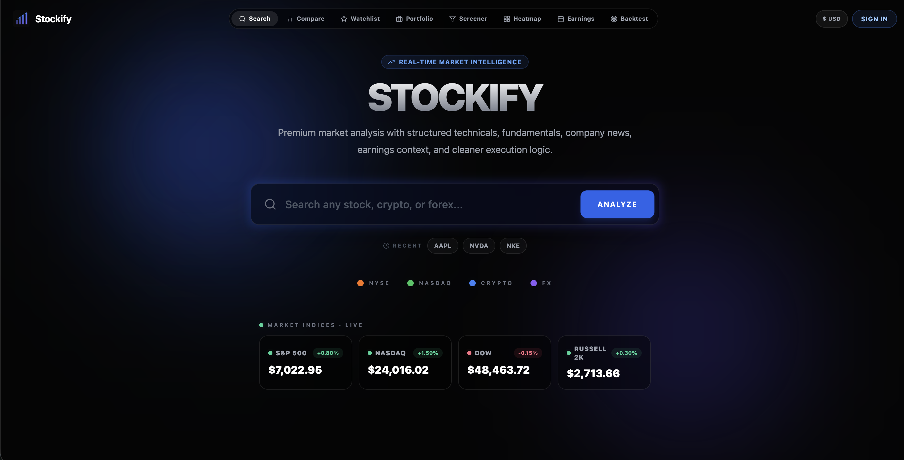
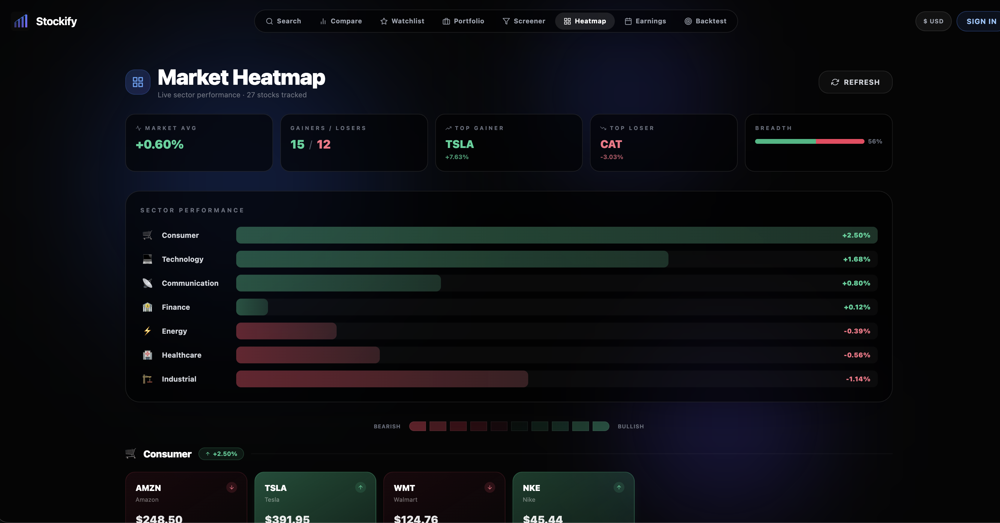
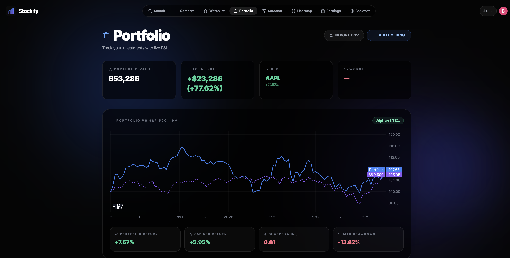
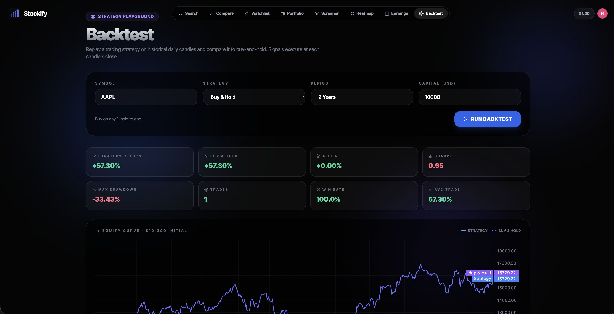
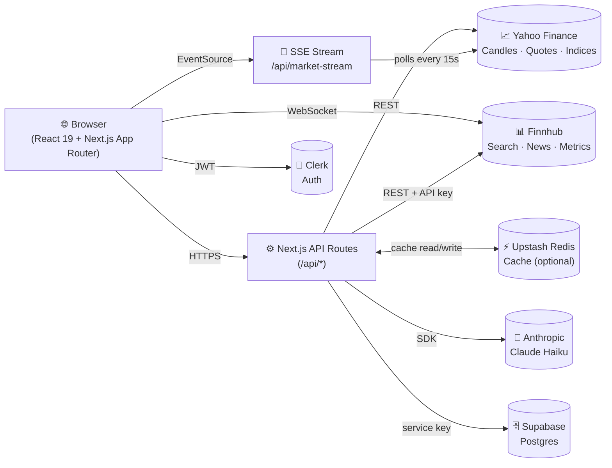

<h1 align="center">
  <br />
  
  
  
  
  
  
  <br /><br />
  📈 Stockify
  <br />
  <sub>Real-time market intelligence — stocks, crypto, forex</sub>
</h1>

<p align="center">
  A fullstack market dashboard that gives you a complete breakdown of any asset in seconds:
  <br />
  live quotes · technicals · fundamentals · news · AI analysis · backtesting · portfolio benchmarking
</p>

<p align="center">
  <a href="#-screenshots">Screenshots</a> •
  <a href="#-features">Features</a> •
  <a href="#%EF%B8%8F-architecture">Architecture</a> •
  <a href="#-tech-stack">Tech Stack</a> •
  <a href="#-getting-started">Getting Started</a>
</p>

---

## 📸 Screenshots

<table>
  <tr>
    <td align="center" width="50%">
      
      <br /><b>🔍 Dashboard</b> — Search any asset, live market indices via SSE
    </td>
    <td align="center" width="50%">
      
      <br /><b>🗺️ Heatmap</b> — Sector performance across 27 stocks
    </td>
  </tr>
  <tr>
    <td align="center" width="50%">
      
      <br /><b>💼 Portfolio</b> — Holdings tracker with S&P 500 benchmark
    </td>
    <td align="center" width="50%">
      
      <br /><b>🧪 Backtest</b> — Strategy playground with equity curves
    </td>
  </tr>
</table>

---

## ✨ Features

| Feature | Description |
|---------|-------------|
| 🔍 **Search & Analyze** | Stocks, crypto (`BTC`), forex (`EUR/USD`) — autocomplete, recent searches, `Cmd+K` |
| 📡 **Live Data** | WebSocket price ticks + SSE market stream pushing indices every 15s |
| 📊 **Technicals** | RSI, MACD, SMA/EMA, ATR, volatility, 52-week range — computed client-side |
| 🤖 **AI Analyst** | Streams a bull/bear thesis from Claude Haiku with quote + metrics + news context |
| 🧪 **Backtesting** | RSI, SMA cross, MACD strategies over 1Y/2Y/5Y — equity curve, Sharpe, drawdown |
| 💼 **Portfolio** | Holdings with P&L, allocation chart, CSV import, 6-month SPY benchmark |
| 🗺️ **Heatmap** | Sector-based market heatmap with breadth stats across 27 stocks |
| 🔎 **Screener** | Filter & sort top 50 S&P 500 stocks by P/E, dividend, beta, market cap |
| ⚖️ **Compare** | Side-by-side analysis of 2–4 tickers with normalized performance chart |
| ⭐ **Watchlist** | Drag-and-drop with live WebSocket prices |
| 📅 **Earnings** | Weekly earnings calendar with EPS estimates |
| 🔔 **Alerts** | Price alerts with browser + sound notification |
| 💱 **Multi-Currency** | USD / EUR / GBP / ILS with live exchange rates |
| 📄 **Export** | Per-ticker PDF reports and portfolio CSV |
| 🔐 **Auth** | Clerk (Google + GitHub OAuth), protected routes |

---

## 🏗️ Architecture



**Key design decisions:**

- **🔀 Dual data sources** — Yahoo Finance for candles, quotes & indices (no rate limits). Finnhub for search, company info, news, earnings, metrics (60 req/min free tier).
- **🔒 Server-only API keys** — Finnhub and Anthropic keys never touch the browser. All calls go through `/api/*` routes.
- **⚡ Redis cache is optional** — App works without Upstash; `lib/cache.ts` falls back to a no-op. TTLs: quotes 15s, company 1h, metrics 5min.
- **📡 SSE over polling** — `/api/market-stream` pushes index snapshots every 15s. Single connection, zero client-driven cadence.
- **🧮 Client-side technicals** — RSI/MACD/SMA computed from raw candles in `lib/backtest.ts`. Keeps the API lean and makes the backtest engine reusable.
- **📦 Batched fetching** — Heatmap and screener fetch in groups with delays to respect rate limits.

---

## 🛠️ Tech Stack

| Layer | Technology |
|-------|-----------|
| **Framework** | Next.js 15 (App Router), React 19, TypeScript 5 |
| **Styling** | Tailwind CSS 3, glassmorphism dark/light theme |
| **Charts** | Lightweight Charts v5 (TradingView open-source) |
| **Auth** | Clerk v7 with Google/GitHub OAuth |
| **Database** | Supabase PostgreSQL |
| **Cache** | Upstash Redis (optional, graceful fallback) |
| **Market Data** | Yahoo Finance + Finnhub |
| **AI** | Anthropic Claude Haiku (streaming) |
| **Real-time** | Server-Sent Events + Finnhub WebSocket |
| **Testing** | Jest + React Testing Library |
| **CI/CD** | GitHub Actions (lint → type-check → test → build) |
| **Deployment** | Vercel |

---

## 🚀 Getting Started

```bash
git clone https://github.com/Barel-dev/Stockify.git
cd Stockify
npm install
cp .env.example .env.local   # fill in your keys
npm run dev                   # → http://localhost:3000
```

### Environment Variables

**Required:**

```env
FINNHUB_API_KEY=                        # finnhub.io (free tier works)
NEXT_PUBLIC_CLERK_PUBLISHABLE_KEY=      # clerk.com
CLERK_SECRET_KEY=
SUPABASE_URL=                           # supabase.com
SUPABASE_SERVICE_ROLE_KEY=
```

**Optional:**

```env
ANTHROPIC_API_KEY=                      # enables AI Analyst
UPSTASH_REDIS_REST_URL=                 # enables response caching
UPSTASH_REDIS_REST_TOKEN=
```

### Database Setup

Run this SQL in your Supabase dashboard:

```sql
create table watchlist (
  id uuid default gen_random_uuid() primary key,
  user_id text not null,
  symbol text not null,
  company_name text not null default '',
  added_at timestamptz default now()
);
create unique index idx_watchlist_user_symbol on watchlist(user_id, symbol);

create table portfolio (
  id uuid default gen_random_uuid() primary key,
  user_id text not null,
  symbol text not null,
  shares numeric not null,
  buy_price numeric not null,
  company_name text not null default '',
  created_at timestamptz default now()
);

create table alerts (
  id uuid default gen_random_uuid() primary key,
  user_id text not null,
  symbol text not null,
  target_price numeric not null,
  direction text not null check (direction in ('above','below')),
  triggered boolean default false,
  created_at timestamptz default now()
);
```

---

## 📁 Project Structure

```
app/
  page.tsx                # 🔍 Main search + dashboard
  backtest/page.tsx       # 🧪 Strategy playground
  compare/page.tsx        # ⚖️ 2-4 ticker comparison
  watchlist/page.tsx      # ⭐ Live-priced watchlist
  portfolio/page.tsx      # 💼 Holdings + SPY benchmark
  screener/page.tsx       # 🔎 S&P 500 screener
  heatmap/page.tsx        # 🗺️ Sector heatmap
  earnings/page.tsx       # 📅 Earnings calendar
  api/                    # ⚙️ 18 API routes

components/
  Navbar, Background, StockChart, AIAnalyst,
  PortfolioBenchmark, OnboardingTour, ErrorBoundary, Skeleton

lib/
  finnhub, supabase, cache, backtest, currency,
  use-currency, use-live-prices, use-alert-checker, export
```

---

## 📋 Scripts

```bash
npm run dev          # Start dev server
npm run build        # Production build
npm run lint         # ESLint
npm run test         # Jest tests
npm run test:ci      # Jest in CI mode
```

---

## 📄 License

ISC
